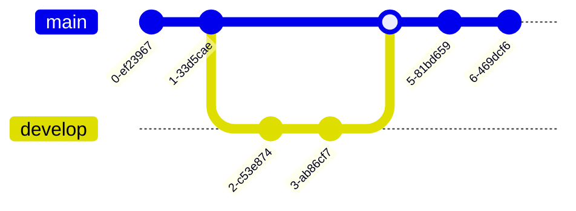

# git-cheatsheet

## Initiation de l'exercice

A partir de ce dépôt-ci, réalisez une cheatsheet de git. 

Dans un premier temps réalisez un fork de ce dépôt et répartissez vous ce projet pour travailler à deux ou trois. 

Le livrable final attendu :
- Avoir un sommaire
- Avoir des sections pour chaque fonctionnalité de git. Cette section doit contenir les commandes de base 
	- commit / add / log / squash / branch / checkout / revert / reset ...
- Pour chaque instruction, il est attendu d'avoir une description textuelle
- Pour chaque section il est attendu d'avoir un petit graph mermaid

## Livraison de l'exercice

En fin de journée, réaliser une merge request au formateur. 
  - Attention, l'historique des commits doit être propre. 
  - Ainsi un commit par fonctionnalité présentée
  - Utilisation des branches
  - Une feature par fonctionnalité


## Luis

- merge : Permet d'intégrer le travail fait dans une branche à une autre.

- log
- remote add
- pull
- rebase


## Greg

- stash : Sauvegarde temporairement son travail.
- stash pop : Réapplique les sauvegardes temporaires.
- log : Affiche-les commits de validation.
- reset : Annule les modifications locales apportées au référentiel.
- diff
- branch : Liste, créer ou supprime des branches.
- push : Met à jour le dépôt distant.
- prune : Supprime les branches inutiles.


## Hugo

- git init: Crée un nouveau dépôt GIT vide ou réinitialise un dépôt existant.
- git clone [url]: Clone un dépôt existant à partir de son url. Par défaut, l'opération s'exécute dans le dossier courant.
- add
- commit
- git checkout [branch]: Permet de basculer sur une autre branche.
  ```mermaid
      gitGraph
        commit
        commit
        branch dev
        commit
        checkout main
        merge dev
        commit```
- fetch