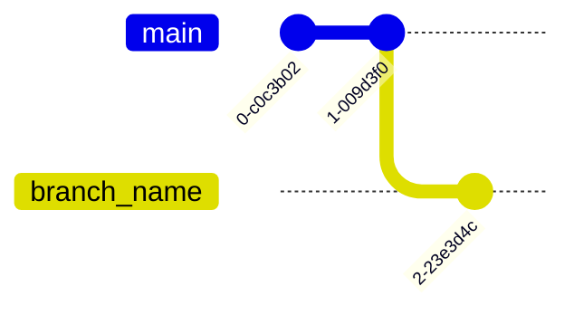
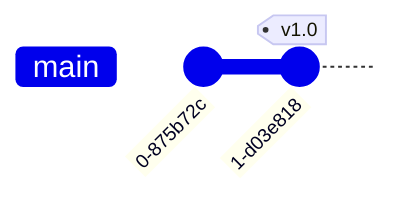
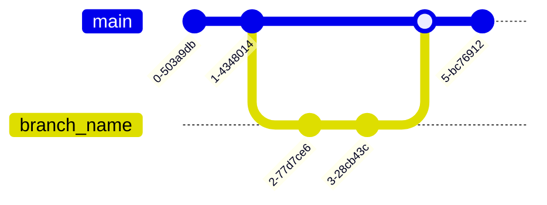
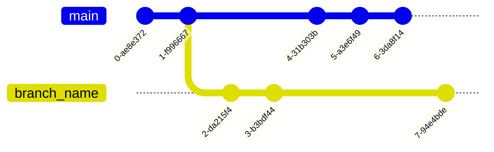
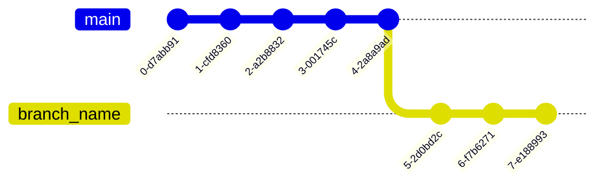

# Git Cheatsheet

## CREATE

Clone existing repository

```shell
git clone git@github.com:user/repo.git
```

Create new repository

```shell
git init
```

## LOCAL CHANGES

Changed files in your working directory

```shell
git status
```

Changes to tracked files

```shell
git diff
```

Add all current changes to the next commit

```shell
git add .
```

Add some changes in \<file> to the next commit

```shell
git add -p <file>
```

Commit all local changes in tracked files

```shell
git commit -a
```


Commit previously staged changes

```shell
git commit
```

Change the last commit

*Don‘t amend published commits!*

```shell
git commit --amend
```

## COMMIT HISTORY

Show all commits, starting with newest

```shell
git log
```

Show changes over time for a specific file

```shell
git log -p <file>
```

Who changed what and when in \<file>

```shell
git blame <file>
```

## BRANCHES & TAGS

Create a new branch

```shell
git branch <branch_name>
```



List all branches

```shell
git branch
```

Switch to a branch

```shell
git checkout <branch_name>
```

Delete a local branch

```shell
git branch -d <branch_name>
```

Delete a remote branch

```shell
git push origin --delete <branch_name>
```

Create a new tag

```shell
git tag <tag_name>
```
*to push tags to remote*

```shell
git push --tags
```



## UPDATE & PUBLISH

List all currently configured remotes

```shell
git remote -v
```

Show information about a remote

```shell
git remote show <remote>
```

Add new remote repository, named \<remote>

```shell
git remote add <shortname> <url>
```

Download all changes from \<remote>, but don‘t integrate into HEAD

```shell
git fetch <remote>
```

Download changes and directly merge/integrate into HEAD

```shell
git pull <remote> <branch>
```

Publish local changes on a remote

```shell
git push <remote> <branch>
```
## MERGE & REBASE

Merge a branch into your active branch

```shell
git merge <branch_name>
```



Rebase your current branch onto \<branch_name>

```shell
git rebase <branch_name>
```
*Avant Rebase*  

*Après Rebase*  


Abort a rebase

```shell
git rebase --abort
```

Continue a rebase after resolving conflicts

```shell
git rebase --continue
```

## UNDO

Discard all local changes in your working directory

```shell
git reset --hard HEAD
```

Reset your HEAD pointer to a previous commit ...and discard all changes since then

```shell
git reset --hard <commit>
```

...and preserve all changes as unstaged changes

```shell
git reset <commit>
```

...and preserve uncommitted local changes

```shell
git reset --keep <commit>
```

Discard local changes in a specific file

```shell
git checkout HEAD <file>
```

Revert a commit (by producing a new commit with contrary changes)

```shell
git revert <commit>
```

## STASH

Stash the changes in a dirty working directory away

```shell
git stash
```

List all stashed changesets

```shell
git stash list
```

Apply the most recently stashed changeset

```shell
git stash apply
```