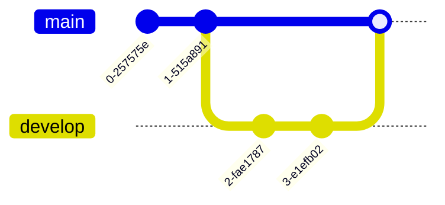

# git-cheatsheet

## Initiation de l'exercice

A partir de ce dépôt-ci, réalisez une cheatsheet de git. 

Dans un premier temps réalisez un fork de ce dépôt et répartissez vous ce projet pour travailler à deux ou trois. 

Le livrable final attendu :
- Avoir un sommaire
- Avoir des sections pour chaque fonctionnalité de git. Cette section doit contenir les commandes de base 
	- commit / add / log / squash / branch / checkout / revert / reset ...
- Pour chaque instruction, il est attendu d'avoir une description textuelle
- Pour chaque section il est attendu d'avoir un petit graph mermaid

## Livraison de l'exercice

En fin de journée, réaliser une merge request au formateur. 
  - Attention, l'historique des commits doit être propre. 
  - Ainsi un commit par fonctionnalité présentée
  - Utilisation des branches
  - Une feature par fonctionnalité


## Luis

- merge : Permet d'intégrer le travail fait dans une branche à une autre.


Ce qui se fait par le biais des commandes suivantes :


```shell
checkout main && merge develop
```

- log : Permet de parcourir l'historique du dépôt GIT
- remote add : Permet d'ajouter un dépôt GIT au projet.
- pull : git pull lance un git fetch et si notre dépôt local n'est pas à jour, alors il va télécharger les commits manquants.
- rebase


## Greg

- **stash** : Sauvegarde temporairement son travail.
- **stash pop** : Réapplique les sauvegardes temporaires.
- **log** : Affiche-les commits de validation.
- **reset** : Annule les modifications locales apportées au référentiel.
  
```mermaid
gitGraph
       commit
       commit
       branch develop
       checkout develop
       commit
       commit
       checkout main
       merge develop
       commit
       commit
  ```
  ```mermaid
gitGraph
       commit
       commit
       branch develop
       checkout develop
       commit
       commit
       checkout main
       merge develop
       commit
  ```
- **diff** : Affiche les modifications entre les commits.
- **branch** : Liste, créer ou supprime des branches.
- **push** : Met à jour le dépôt distant.
- **prune** : Supprime les branches inutiles.
```mermaid
gitGraph
       commit
       commit
       branch test
       commit
       commit
       commit
       checkout main
       branch develop
       checkout develop
       commit
       commit
       checkout main
       merge develop
       commit
       commit
  ```
```mermaid
gitGraph
       commit
       commit
       branch develop
       checkout develop
       commit
       commit
       checkout main
       merge develop
       commit
       commit
  ```

## Hugo

- **git init**: Crée un nouveau dépôt GIT vide ou réinitialise un dépôt existant.
- **git clone [url]**: Clone un dépôt existant à partir de son url. Par défaut, l'opération s'exécute dans le dossier courant.
- add
- commit
- **git checkout [branch]**: Permet de basculer sur une autre branche.
  Dans l'exemple suivant, on crée une branche "dev" avec "git branch dev". Pour travailler dessus, on utilise la commande "git checkout dev".
  ```mermaid
      gitGraph
        commit
        commit
        branch dev
        checkout dev
        commit
        commit
  ```
- fetch