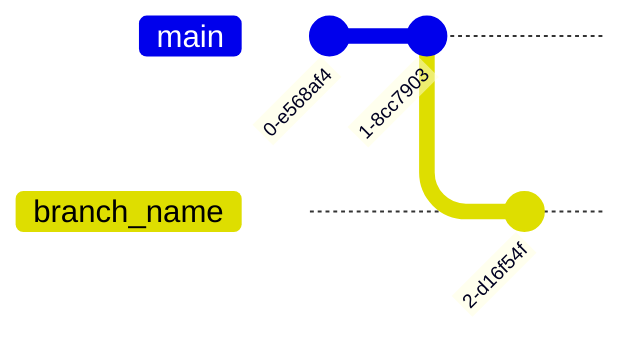

# Git Cheatsheet

## CREATE

Clone existing repository

```shell
git clone git@github.com:user/repo.git
```

Create new repository

```shell
git init
```

## BRANCHES & TAGS

Create a new branch

```shell
git branch <branch_name>
```



List all branches

```shell
git branch
```

Switch to a branch

```shell
git checkout <branch_name>
```

Delete a local branch

```shell
git branch -d <branch_name>
```

Delete a remote branch

```shell
git push origin --delete <branch_name>
```