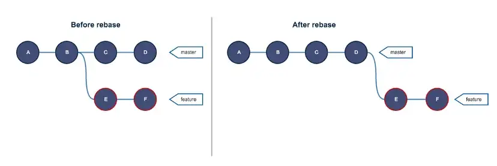

<span style="color:red ; font-size:50px">Git CheatSheet</span>  
*by Guéwen Carré & Miharisoa Babef*

---
<span style="font-size:30px">Sommaire</span>

- Git c'est quoi ? [ici](#head1)
- Commandes de base [ici](#head2)
- Commandes Avancée [ici](#head3)
- Annexe [ici](#head4)

---


<a name="head1"></a>## Git c'est quoi ?

Git est un outil de **versionning** ou **système de contrôle de version**. Un projet open source largement utiliser dans le monde.  

<a name="head2"></a>## Commande de base
### **INIT**
Initialise un nouveau dépôt Git dans le répertoire courant.
```
 $ git init 
```
### **CLONE**
Clone un dépôt Git existant sur votre ordinateur
```
 $ git clone <url du projet>
```
### **ADD**
Ajout l'ensemble des fichiers du depot  
🚨 n'est pas conseillé !! 🚨
```
$ git add .
```
Ajoute un ou des fichiers dans la zone de transite avant le commit.
```
$ git add <fichier>
```
Permettre l’ajout de fichiers qui sont normalement ignorés.
```
$ git add --force <fichier>
```

### **COMMIT**
Enregistre les modifications actuelles dans l'historique du dépôt Git avant le push.
```
$ git commit -m "<message>"
```
### **PUSH**
Envoie les commits locaux vers un dépôt distant.
```
$ git push <remote> <branche>
```

### **PULL**
Récupère la dernière version d'un dépôt distant.

```
$ git pull <remote> <branche>
```

### **STATUS**
Affiche l'état des fichiers dans le dépôt Git, y compris les fichiers modifiés et non suivis.
```
$ git status
```
<a name="head3"></a># Commandes Avancées

### **BRANCHE**
Affiche la liste des branches dans le dépôt Git.
```
$ git branch
```
voir +

### **LOG**
Affiche l'historique des commits du dépôt Git.
```
$ git log
```
```
$ git log --oneline
```
### **DIFF**
Affiche les différences entre les fichiers dans le dépôt Git.
```
$ git diff
```

### **RESET**
Annule les commits dans le dépôt Git.

```
$ git reset
```

### **REVERT**
Annule les commits dans le dépôt Git sans supprimer les commits 
```
$ git revert 
```


### **STASH**
Git stash permet d'enregistrer les modification dans une zone tampon.
```
$ git stash
```

Permet de lister les stash
``` 
$ git stash list
```

Permet de voir les details du commit dans le stash 
``` 
$ git stash show <numero commit>
```
Supprime le stash le plus récente

``` 
$ git stash drop
```
Applique le stash et le supprime 

``` 
$ git stash pop
```

Applique le stash mais le supprime pas 

``` 
$ git stash apply
```

## **SQUASH**
le squash est un regroupement de commits
si vous voulez squesher les 3 derniers commits
``` 
$ git rebase -i HEAD~3
```
ici les 2 derniers commits seront fusionnés
```
pick abc123 Mon premier commit
squash def456 Mon deuxième commit
squash ghi789 Mon troisième commit
```


### Fusionner les branches  
Cette commande permet de fusionner les branches et donc de rassembler les modifications.  

```shell
$ git merge BranchTest main
```


> La La branche **main** a fusionné les changements de la branche **BrancheTest**

### Rebaser les commits d'une branche
Cette commande permet de rebaser les commits d'une branche vers une autre 

```shell
$ git rebase main BrancheTest
```


> Avant le rebase nous avons deux branches distinctes, **master** et **feature** . Après le rebase nous avons une unique branche master possèdant les commits de la branche **master**.

## Branch

### Voir la branche active

```shell
$ git branch
* main
```
### Créer une nouvelle branch
```shell
$ git branch BrancheTest
```

> La branche `BrancheTest` vient d'être créer

### Voir toutes les branches

```shell
$ git branch -a
* main
  BrancheTest
  remote/origin/HEAD
```

### Changer de branches active
Cette commande permet de changer de branche active, autrement dit, on se place sur une autre branche.  

```shell
$ git checkout BrancheTest
```

> La branche active est la branche `BrancheTest`

## **Annexe**


<a name="head2"></a> 
  


- Schéma GIT : [git_overflow](./images/git_overflow.png)
- Comment faire un Markdown : [Markdown](https://www.markdownguide.org/cheat-sheet/#basic-syntax)


