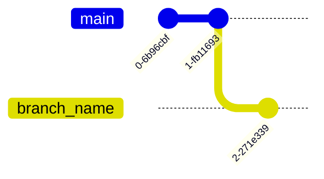

# Git Cheatsheet

## CREATE

Clone existing repository

```shell
git clone git@github.com:user/repo.git
```

Create new repository

```shell
git init
```

## LOCAL CHANGES

Changed files in your working directory

```shell
git status
```

Changes to tracked files

```shell
git diff
```

Add all current changes to the next commit

```shell
git add .
```

Add some changes in \<file> to the next commit

```shell
git add -p <file>
```

Commit all local changes in tracked files

```shell
git commit -a
```


Commit previously staged changes

```shell
git commit
```

Change the last commit

*Don‘t amend published commits!*

```shell
git commit --amend
```

## COMMIT HISTORY

Show all commits, starting with newest

```shell
git log
```

Show changes over time for a specific file

```shell
git log -p <file>
```

Who changed what and when in \<file>

```shell
git blame <file>
```

## BRANCHES & TAGS

Create a new branch

```shell
git branch <branch_name>
```



List all branches

```shell
git branch
```

Switch to a branch

```shell
git checkout <branch_name>
```

Delete a local branch

```shell
git branch -d <branch_name>
```

Delete a remote branch

```shell
git push origin --delete <branch_name>
```

Create a new tag

```shell
git tag <tag_name>
```

## UPDATE & PUBLISH

List all currently configured remotes

```shell
git remote -v
```

Show information about a remote

```shell
git remote show <remote>
```

Add new remote repository, named \<remote>

```shell
git remote add <shortname> <url>
```

Download all changes from \<remote>, but don‘t integrate into HEAD

```shell
git fetch <remote>
```