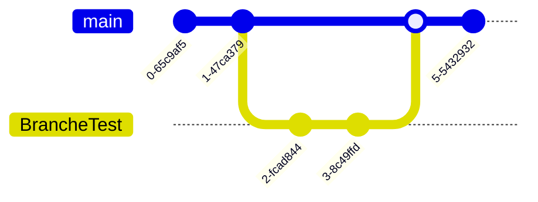

# Git Cheat Sheet

[Markdown](https://www.markdownguide.org/cheat-sheet/#basic-syntax)

---

## Git c'est quoi ?

Git est un outil de **versionning** ou **système de contrôle de version**. Un projet open source largement utiliser dans le monde.

## Branch

### Voir la branche active

```shell
$ git branch
* main
```
### Créer une nouvelle branch
```shell
$ git branch BrancheTest
```

> La branche `BrancheTest` vient d'être créer

### Voir toutes les branches

```shell
$ git branch -a
* main
  BrancheTest
  remote/origin/HEAD
```

### Changer de branches active
Cette commande permet de changer de branche active, autrement dit, on se place sur une autre branche.  

```shell
$ git checkout BrancheTest
```

> La branche active est la branche `BrancheTest`


### Fusionner les branches  
Cette commande permet de fusionner les branches et donc de rassembler les modifications.  

```shell
$ git merge BranchTest main
```


> La La branche **main** a fusionné les changements de la branche **BrancheTest**

### Rebaser les commits d'une branche
Cette commande permet de rebaser les commits d'une branche vers une autre 

```shell
$ git rebase main BrancheTest
```


> Avant le rebase nous avons deux branches distinctes, **master** et **feature** . Après le rebase nous avons une unique branche master possèdant les commits de la branche **master**.