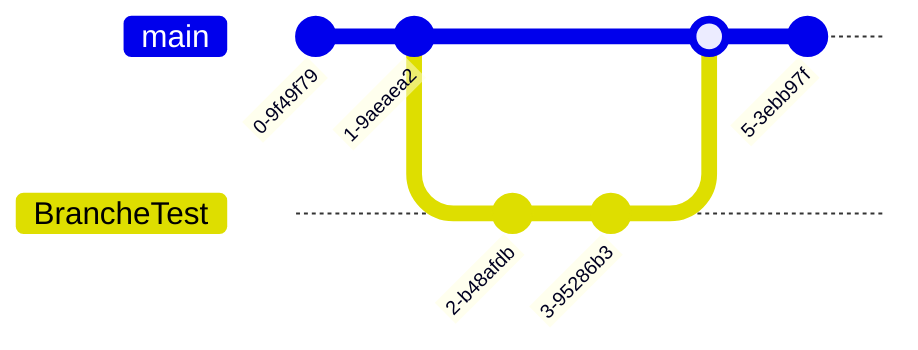
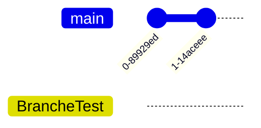
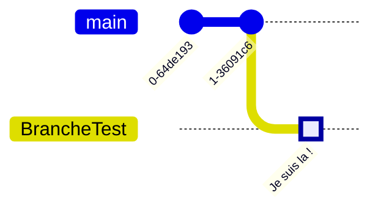

# <center>Git Cheat Sheet </center>

[Markdown](https://www.markdownguide.org/cheat-sheet/#basic-syntax)

---

## Git c'est quoi ? 

Git est un outil de **versionning** ou **système de contrôle de version**. Un projet open source largement utiliser dans le monde.  

## Commande de base
### Init
Initialise un nouveau dépôt Git dans le répertoire courant.
```shell
 $ git init 
```

```mermaid
gitGraph 
```
> La branche `main` est crée suite à l'initialisation

### Clone
Clone un dépôt Git existant sur votre ordinateur
```shell
 $ git clone <url du projet>
```
### Add
Ajout l'ensemble des fichiers du depot  
**🚨 ce n'est pas conseillé d'ajouter tous les fichiers d'un coup  !! 🚨**
```shell
$ git add .
```
Ajoute un ou des fichiers dans la zone de transite avant le commit.
```shell
$ git add <fichier>
```
Permettre l’ajout de fichiers qui sont normalement ignorés.
```shell
$ git add --force <fichier>
```

### Commit
Enregistre les modifications actuelles dans l'historique du dépôt Git avant le push.
```shell
$ git commit -m "<message>"
```
### Push
Envoie les commits locaux vers un dépôt distant.
```shell
$ git push <remote> <branche>
```

### Pull
Récupère la dernière version d'un dépôt distant.

```shell
$ git pull <remote> <branche>
```

### Status
Affiche l'état des fichiers dans le dépôt Git, y compris les fichiers modifiés et non suivis.
```shell
$ git status
```
## Commande secondaire

### Branche
Affiche la liste des branches dans le dépôt Git.
```shell
$ git branch
```
voir +

### Log
Affiche l'historique des commits du dépôt Git.
```shell
$ git log
```
```shell
$ git log --oneline
```
### Diff
Affiche les différences entre les fichiers dans le dépôt Git.
```shell
$ git diff
```

### Reset
Annule les commits dans le dépôt Git.

```shell
$ git reset
```

### Revert
Annule les commits dans le dépôt Git sans supprimer les commits 
```shell
$ git revert 
```

### Stash
Git stash permet d'enregistrer les modification dans une zone tampon.
```shell
$ git stash
```

Permet de lister les stash
``` shell
$ git stash list
```

Permet de voir les details du commit dans le stash 
```shell
$ git stash show <numero commit>
```
Supprime le stash le plus récente

```shell 
$ git stash drop
```
Applique le stash et le supprime 

```shell
$ git stash pop
```

Applique le stash mais le supprime pas 

```shell 
$ git stash apply
```


### Squash
le squash est un regroupement de commits
si vous voulez modifier les 3 derniers commits
```shell 
$ git rebase -i HEAD~3
```
ici les 2 derniers commits seront fusionnés
```shell
pick abc123 Mon premier commit
squash def456 Mon deuxième commit
squash ghi789 Mon troisième commit
```


### Fusionner les branches  
Cette commande permet de fusionner les branches et donc de rassembler les modifications.  

```shell
$ git merge BranchTest main
```


```mermaid
gitGraph
    commit
    commit
    branch BrancheTest
    checkout BrancheTest
    commit
    commit
    checkout main
    merge BrancheTest
    commit
```
> La La branche **main** a fusionné les changements de la branche **BrancheTest**

> Avant le rebase nous avons deux branches distinctes, **master** et **feature** . Après le rebase nous avons une unique branche master possèdant les commits de la branche **master**.

## Branch

### Voir la branche active

```shell
$ git branch
* main
```
### Créer une nouvelle branch
```shell
$ git branch BrancheTest
```

```mermaid
gitGraph
    commit
    commit
    branch BrancheTest
    
```
> La branche `BrancheTest` vient d'être créer

### Voir toutes les branches

```shell
$ git branch -a
* main
  BrancheTest
  remote/origin/HEAD
```

### Changer de branches active
Cette commande permet de changer de branche active, autrement dit, on se place sur une autre branche.  

```shell
$ git checkout BrancheTest
```

```mermaid
gitGraph
    commit
    commit
    branch BrancheTest
    checkout BrancheTest
    commit id: "Je suis la !" type: HIGHLIGHT
```
> La branche active est la branche `BrancheTest`
### Rebaser les commits d'une branche
Cette commande permet de rebaser les commits d'une branche vers une autre 

```shell
$ git rebase main BrancheTest
```


## Comment gérer les conflits de Merge

<font size="5"> **1.** </font> <font size=3> Il faut d'abord récupérer la dernière version du main sur lle serveur distant depuis sa branche afin de se synchroniser avec la dernière version reçue.</font>  

<font size="5"> **2.** </font> <font size=3> Modifier les fichiers afin de régler les conflits </font>  

<font size="5"> **3.** </font> <font size=3> Refaire un commit et un push. </font>
