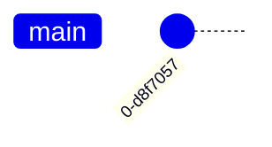

# Git Cheatsheet

## CREATE

Clone existing repository

```shell
git clone git@github.com:user/repo.git
```

Create new repository

```shell
git init
```

## LOCAL CHANGES

Changed files in your working directory

```shell
git status
```

Changes to tracked files

```shell
git diff
```

Add all current changes to the next commit

```shell
git add .
```

Add some changes in \<file> to the next commit

```shell
git add -p <file>
```

Commit all local changes in tracked files

```shell
git commit -a
```



Commit previously staged changes

```shell
git commit
```

Change the last commit

*Don‘t amend published commits!*

```shell
git commit --amend
```

## COMMIT HISTORY

Show all commits, starting with newest

```shell
git log
```

Show changes over time for a specific file

```shell
git log -p <file>
```