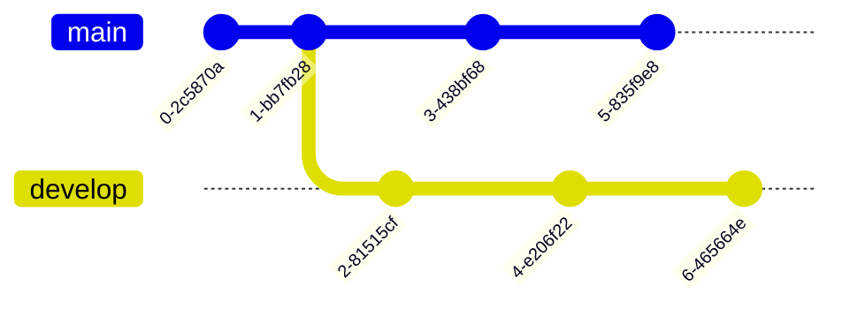

## Luis

- merge : Permet d'intégrer le travail fait dans une branche à une autre.


Ce qui se fait par le biais des commandes suivantes :


```shell
checkout main && merge develop
```

- log : Permet de parcourir l'historique du dépôt GIT
- remote add : Permet d'ajouter un dépôt GIT au projet.
- pull : git pull lance un git fetch et si notre dépôt local n'est pas à jour, alors il va télécharger les commits manquants.
- rebase : permet de déplacer la base d'une branche pour la regreffer à un autre endroit sur l'arbre.
Avant rebase :

Après rebase :


## Greg

- **stash** : Sauvegarde temporairement son travail.
- **stash pop** : Réapplique les sauvegardes temporaires et les supprime.
- **stash apply** : Réapplique les sauvegardes temporaires mais les garde en mémoire.
- **log** : Affiche-les commits de validation.

- **reset** : Annule les modifications locales apportées au référentiel.
  
```mermaid
gitGraph
       commit
       commit
       branch develop
       checkout develop
       commit
       commit
       checkout main
       merge develop
       commit
       commit
  ```
  ```mermaid
gitGraph
       commit
       commit
       branch develop
       checkout develop
       commit
       commit
       checkout main
       merge develop
       commit
  ```
- **diff** : Affiche les modifications entre les commits.
- **branch** : Liste, créer ou supprime des branches.
```mermaid
gitGraph
       commit
       commit
       branch develop
       commit
       commit
       commit
       branch branch1
       commit
       checkout develop
       branch branch2
       commit
       checkout develop
       branch branch3
       commit
       commit
 ```
- **push** : Met à jour le dépôt distant.

- **prune** : Supprime les branches inutiles.
```mermaid
gitGraph
       commit
       commit
       branch test
       commit
       commit
       commit
       checkout main
       branch develop
       checkout develop
       commit
       commit
       checkout main
       merge develop
       commit
       commit
  ```
```mermaid
gitGraph
       commit
       commit
       branch develop
       checkout develop
       commit
       commit
       checkout main
       merge develop
       commit
       commit
  ```

## Hugo

- **git init**: Crée un nouveau dépôt GIT vide ou réinitialise un dépôt existant.
- **git clone [url]**: Clone un dépôt existant à partir de son url. Par défaut, l'opération s'exécute dans le dossier courant.
- **git add [filename]**: Ajoute le fichier indiqué au staging. Effectuer "git add *" permet d'ajouter tous les fichiers du dossier au staging.
- **git commit**: Enregistre les changements ajoutés avec "git add" dans le dépôt local. Enregistrer un commit dans le dépôt en ligne requiert un "git push".
- **git checkout [branch]**: Permet de basculer sur une autre branche. Dans l'exemple suivant, on crée une branche "dev" avec "git branch dev". Pour travailler dessus, on utilise la commande "git checkout dev".
  ```mermaid
      gitGraph
        commit
        commit
        branch dev
        checkout dev
        commit
        commit
  ```
- **git fetch**: Télécharge les commits, les fichiers et les réfs d'un dépôt distant vers votre dépôt local. Git isole le contenu ainsi récupéré. Pour l'intégrer au projet, il faut effectuer un "git checkout".